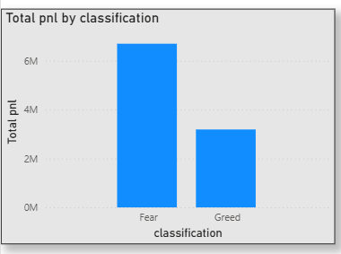
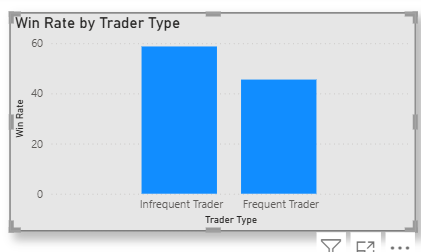

# Crypto-Trading-Analysis
Analysis of trader performance vs market sentiment (Fear/Greed) using Python and Power BI, uncovering behavioral patterns and strategy insights.

## **Objective**
Analyze how market sentiment (Fear vs Greed) impacts trader behavior and performance.
## **Methodology**

- Cleaned and merged trader + sentiment datasets using Python
- Converted timestamps to daily level
- Created key metrics:
  - Daily PnL per trader
  - Win rate
  - Average trade size
  - Trade frequency
  - Long/Short ratio
- Built interactive dashboard in Power BI for visualization
##  Key Analysis & Findings

### 1. Performance: Fear vs Greed

- Total PnL is higher during **Fear** periods compared to Greed periods
- Despite lower confidence in the market, traders generate more profit during Fear
- Fear periods show higher overall profitability but also higher uncertainty
- 
- **Conclusion:**  Traders perform better during high-volatility Fear conditions
  
#####  PnL by Sentiment

PnL is significantly higher during Fear periods (~6M vs ~3M), showing that volatility creates better trading opportunities.

- 
- ### 2. Behavioral Changes Based on Sentiment

- Trade frequency increases during **Greed** periods
- Average position size is larger during Greed
- Traders take more **Long positions** in Greed and more cautious positions during Fear

 **Conclusion:** Traders become more aggressive in Greed and conservative in Fear

### 3. Trader Segmentation

#### a) Frequent vs Infrequent Traders
- Frequent traders execute more trades but have slightly lower win rates
- Infrequent traders show more stable performance
  #####  Win Rate by Trader Type
  Infrequent traders achieve higher win rates than frequent traders, indicating overtrading reduces efficiency.
  

-
#### b) Consistent vs Inconsistent Traders
- Consistent traders maintain steady PnL across sentiments
- Inconsistent traders show high volatility in returns

 Conclusion: Higher activity does not always lead to better performance

 ##  Key Insights

- Traders generate higher total PnL during Fear periods, suggesting volatility creates better profit opportunities
- Despite a relatively low win rate (~42%), overall profitability is high, indicating strong risk-reward dynamics
- Infrequent traders achieve higher win rates than frequent traders, showing that overtrading reduces efficiency
- Traders increase position sizes during Greed periods, reflecting higher risk appetite
- 
- ##  Strategy Recommendations

1. **Trade volatility, not sentiment direction**
   - Focus more on Fear periods where market volatility creates higher profit opportunities

2. **Avoid overtrading**
   - Limit trade frequency as frequent traders show lower win rates

3. **Control risk during Greed**
   - Reduce position size despite higher confidence to avoid large drawdowns

4. **Focus on risk-reward, not win rate**
   - Accept lower win rates if profitable trades outweigh losses

   
   ##  Tools Used

- Python (Pandas, NumPy)
- Power BI (Dashboard & Visualization)

---

##  How to Run

1. Clone the repository
2. Open `Crypto_trading.ipynb` and run all cells
3. Open `crypto dashboard.pbix` in Power BI to view visuals
